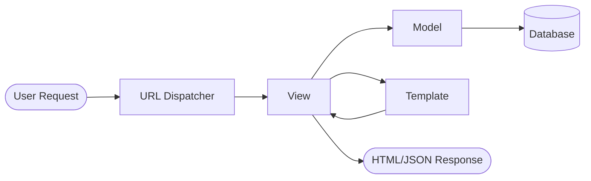

# Django Framework Mastery: Python Web Development

Welcome to the **Django Framework** learning module! This repository is designed to take you from a complete beginner to a confident developer capable of building robust web applications using Django, the "web framework for perfectionists with deadlines."

---

## 📖 Table of Contents

1. [Overview](#-overview)
2. [Why Django?](#-why-django)
3. [Architecture: MVT Pattern](#-architecture-mvt-pattern)
4. [Getting Started](#-getting-started)
5. [Learning Roadmap & Exercises](#-learning-roadmap--exercises)
6. [Core Concepts](#-core-concepts)
7. [Additional Resources](#-additional-resources)

---

## 🌟 Overview

Django is a high-level Python web framework that encourages rapid development and clean, pragmatic design. Built by experienced developers, it takes care of much of the hassle of web development, so you can focus on writing your app without needing to reinvent the wheel.

### Key Objectives
*   🚀 **Master the MVT Pattern**: Understand the Model-View-Template architecture.
*   🛠️ **Project Lifecycle**: Learn to initialize projects, manage apps, and configure routing.
*   🎨 **Dynamic UI**: Work with the powerful Django Template Language (DTL).
*   🗄️ **Database Integration**: Define models and perform migrations.
*   🍪 **State Management**: Handle user sessions and cookies securely.
*   🧪 **Reliability**: Implement automated tests to ensure code quality.
*   🔌 **Extensibility**: Create custom middleware for request/response processing.

---

## 🤔 Why Django?

| Feature | Description |
| :--- | :--- |
| **Batteries Included** | Comes with an ORM, Authentication, Admin Interface, and more out-of-the-box. |
| **Secure** | Helps developers avoid common security mistakes (SQL Injection, XSS, CSRF). |
| **Scalable** | Powers some of the busiest sites on the web (Instagram, Pinterest, Disqus). |
| **Versatile** | Used for CMSs, social networks, scientific computing platforms, and more. |

---

## 🏗️ Architecture: MVT Pattern

Django follows the **Model-View-Template (MVT)** pattern, which is a slight variation of the traditional MVC (Model-View-Controller).



-   **Model**: The data access layer. Handles everything with the database.
-   **View**: The business logic layer. It fetches data from models and passes it to templates.
-   **Template**: The presentation layer. Handles how the user sees the data.

---

## ⚙️ Getting Started

### 1. Environment Setup
Always use a virtual environment to keep your project dependencies isolated.

```bash
# Create a virtual environment
python -m venv venv

# Activate it (Linux/macOS)
source venv/bin/activate

# Activate it (Windows)
.\venv\Scripts\activate
```

### 2. Installation
```bash
pip install django
pip freeze > requirements.txt
```

### 3. Creating Your First Project
```bash
django-admin startproject mysite .
python manage.py runserver
```

---

## 🗺️ Learning Roadmap & Exercises

Navigate through the following exercises to build your skills step-by-step:

| # | Topic | Difficulty | Est. Time | Key Concepts |
| :-- | :--- | :--- | :--- | :--- |
| 1 | [Project Setup](./django-framework-exercises/start-new-project) | 🟢 Low | 20m | `startproject`, `runserver`, `venv` |
| 2 | [URLs & Routing](./django-framework-exercises/urls-and-routing) | 🟡 Medium | 40m | `urlpatterns`, `path()`, `include()` |
| 3 | [Views & Templates](./django-framework-exercises/views-and-templating) | 🟡 Medium | 60m | FBV vs CBV, Template Inheritance, Statics |
| 4 | [Models & Admin](./django-framework-exercises/introduction-to-models) | 🟡 Medium | 45m | `models.Model`, `makemigrations`, `admin` |
| 5 | [Sessions & Cookies](./django-framework-exercises/sessions-and-cookies) | 🟡 Medium | 40m | `migrate`, `request.session`, `set_cookie` |
| 6 | [Testing in Django](./django-framework-exercises/testing-in-django) | 🟡 Medium | 30m | `TestCase`, `SimpleTestCase`, Assertions |
| 7 | [Custom Middleware](./django-framework-exercises/django-middleware) | 🔴 High | 40m | Request/Response Hooks, Settings |

---

## 💡 Core Concepts

### URL Configuration
```python
# urls.py
from django.urls import path
from . import views

urlpatterns = [
    path('hello/', views.hello_world, name='hello'),
]
```

### Simple View (FBV)
```python
# views.py
from django.http import HttpResponse

def hello_world(request):
    return HttpResponse("<h1>Hello, Django!</h1>")
```

### Database Model
```python
# models.py
from django.db import models

class Post(models.Model):
    title = models.CharField(max_length=200)
    content = models.TextField()
```

---

## 📚 Additional Resources

*   📖 [Official Django Documentation](https://docs.djangoproject.com/en/stable/)
*   👭 [Django Girls Tutorial](https://tutorial.djangogirls.org/en/)
*   🌐 [MDN Django Tutorial](https://developer.mozilla.org/en-US/docs/Learn/Server-side/Django)
*   🎥 [Django for Beginners (YouTube)](https://www.youtube.com/results?search_query=django+tutorial)

---
<p align="center">Made with ❤️ for Python Developers</p>
